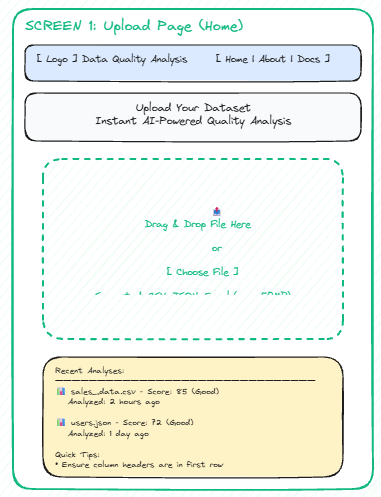
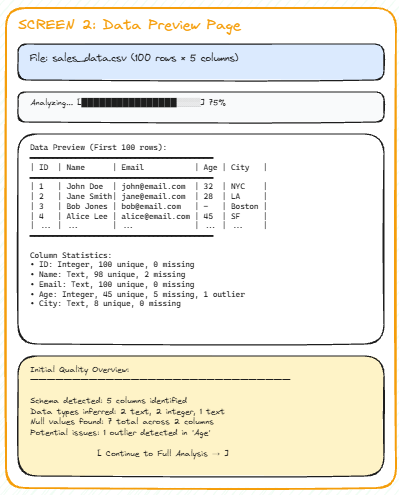
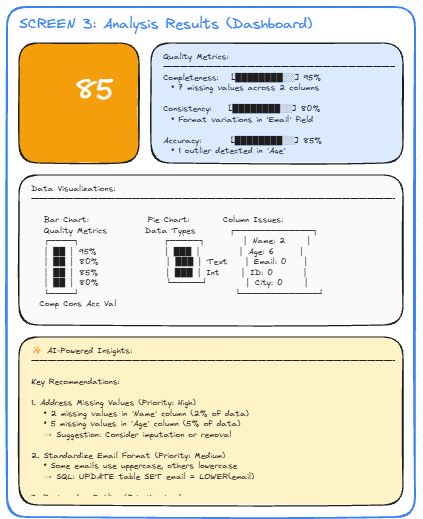
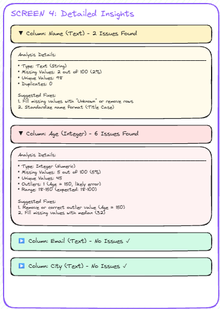
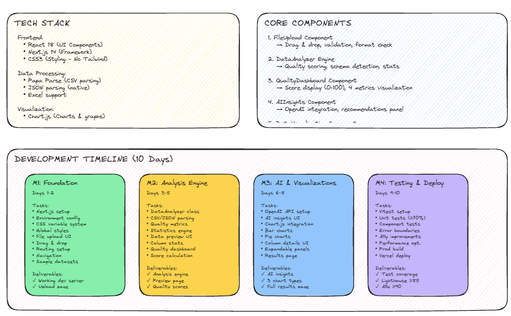

# Wireframes Overview

This document describes the visual design and user interface patterns for the Agentic Data Quality Analysis Platform.

## Design Principles

1. **Mobile-First:** Design starts at 320px width, progressively enhanced
2. **Accessibility:** WCAG 2.1 AA compliance from the start
3. **Performance:** Optimize for fast loading and smooth interactions
4. **Data-Focused:** Clear visualization of complex data quality metrics
5. **Trustworthy:** Professional design that builds confidence in AI insights

## Page Layouts

### 1. Home/Upload Page
- Prominent file upload area with drag-and-drop
- Supported format indicators (CSV, JSON, Excel)
- Recent analyses history
- Quick tips for data preparation



### 2. Data Preview Page
- Tabular view of uploaded dataset
- Column statistics panel (data types, null counts)
- Quality score overview with color-coded indicators
- Progress bar for analysis completion



### 3. Analysis Results Page
- Quality score dashboard with visual metrics
- AI insights panel with natural language explanations
- Interactive charts showing data distributions
- Downloadable recommendations report



### 4. Detailed Insights Page
- Column-by-column quality breakdown
- Issue highlighting within data preview
- Suggested fixes and improvement strategies
- Before/after comparison visualizations



## Tech Stack & Milestones 


## Responsive Breakpoints

- **Mobile:** 320px - 639px (Single column, stacked layout)
- **Tablet:** 640px - 767px (Two-column layout)
- **Desktop:** 768px - 1023px (Three-column dashboard)
- **Large:** 1024px+ (Full dashboard with sidebars)

## Color Palette

### Data Quality States
- **Excellent:** #10b981 (green) - 90%+ quality
- **Good:** #f59e0b (amber) - 70-89% quality  
- **Poor:** #ef4444 (red) - <70% quality
- **Neutral:** #6b7280 (gray) - No data/loading

### Interface
- **Primary:** #3b82f6 (blue) - Actions and links
- **Background:** #f9fafb (light gray)
- **Surface:** #ffffff (white) - Cards and panels
- **Text:** #111827 (dark gray)
- **Border:** #e5e7eb (light gray)

## Typography

- **Font Family:** Inter font stack for data readability
- **Base Size:** 16px
- **Headings:** 600 weight for clear hierarchy
- **Data:** Monospace font for numbers and codes
- **Body:** 400 weight
- **Line Height:** 1.6 for comfortable reading

## Component Patterns

### File Upload
- Drag-and-drop zone with visual feedback
- File format validation and size limits
- Progress indicator for large file processing
- Error states with helpful messages

### Data Quality Score
- Large, prominent score display (0-100)
- Color-coded background based on score range
- Breakdown of contributing factors
- Trend indicator (improvement/decline)

### AI Insights Panel
- Chat-like interface for natural language explanations
- Expandable sections for detailed analysis
- Copy-to-clipboard functionality
- Source data references

### Data Visualization
- Interactive charts with hover details
- Responsive design across screen sizes
- Color-blind friendly palettes
- Export options for presentations

## Visual Layout Examples

### Home/Upload Page Layout
```
┌─────────────────────────────────────────────────┐
│  Data Quality Analysis Platform                 │
│  Upload your dataset to get instant insights    │
├─────────────────────────────────────────────────┤
│                                                 │
│  ┌───────────────────────────────────────────┐ │
│  │    📤 Drag & Drop File Here               │ │
│  │                                           │ │
│  │    or                                     │ │
│  │                                           │ │
│  │    [ Choose File ]                        │ │
│  │                                           │ │
│  │    Supported: CSV, JSON, Excel (max 50MB)│ │
│  └───────────────────────────────────────────┘ │
│                                                 │
└─────────────────────────────────────────────────┘
```

### Analysis Results Page Layout
```
┌─────────────────────────────────────────────────┐
│  Data Quality Analysis                          │
│  File: users.csv (100 rows × 5 columns)         │
├──────────────┬──────────────────────────────────┤
│              │                                  │
│  ┌────────┐  │  Recommendations:               │
│  │   85   │  │  • Address missing values in... │
│  │  Good  │  │  • Validate email formats       │
│  └────────┘  │  • Review outliers in salary... │
│              │                                  │
│  Metrics:    │                                  │
│  Complete:95 │                                  │
│  Consist: 80 │                                  │
│  Accuracy:85 │                                  │
│  Validity:80 │                                  │
├──────────────┴──────────────────────────────────┤
│  📊 Data Quality Visualizations                 │
│  ┌─────────┐  ┌─────────┐                      │
│  │Bar Chart│  │Pie Chart│                      │
│  │Quality  │  │Data Type│                      │
│  │Metrics  │  │Breakdown│                      │
│  └─────────┘  └─────────┘                      │
├─────────────────────────────────────────────────┤
│  ✨ AI-Powered Insights                         │
│  [ Generate Insights ]                          │
│  (AI analysis appears here after generation)    │
├─────────────────────────────────────────────────┤
│  Column Analysis Table                          │
│  Column  | Type   | Missing | Unique | Issues  │
│  name    | text   | 2       | 98     | •...    │
│  age     | number | 5       | 45     | ✓       │
│  email   | text   | 0       | 100    | ✓       │
└─────────────────────────────────────────────────┘
```

*Note: Visual wireframe images can be created using tools like Figma or Excalidraw based on these layouts.*
